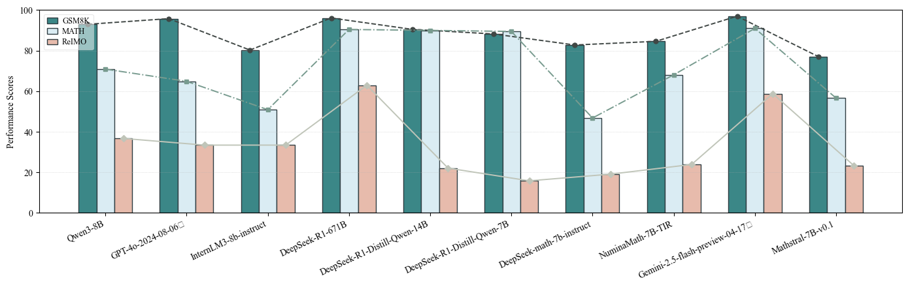

<h1 align="center">
    <br>RIMO
</h1>
<p align="center">
    <a href="http://huggingface.co/datasets/ziye2chen/RIMO">
        
    </a>
    </a>
    <a href="https://github.com/ziye2chen/RIMO">
        
    </a>
</p>

## 📚️ RIMO



This repository contains two complementary tasks:
- **RIMO‑N**: single-step math problems scored by a numeric final answer.
- **RIMO‑P**: multi‑part proof problems solved step‑by‑step and strictly evaluated per sub‑solution.

Datasets live under `RIMO/` and runnable scripts live under `code/`.

### Requirements

- Python 3.10+
- Windows users: run commands in Command Prompt (cmd) from the repo root, e.g. `D:\RIMO`.

Install only what you need:

```bash
pip install pandas openai transformers torch google-genai
```

> [!NOTE]
>
> For local/Transformer models, a GPU with sufficient VRAM is strongly recommended.
> For API usage, set provider keys as environment variables (see below). RIMO‑P examples use an OpenAI‑compatible endpoint from Aliyun DashScope (Bailian). See the Bailian console: [Aliyun Bailian (DashScope) console](https://bailian.console.aliyun.com/).


<!-- Notes:
- For local/Transformer models, a GPU with sufficient VRAM is strongly recommended.
- For API usage, set provider keys as environment variables (see below). RIMO‑P examples use an OpenAI‑compatible endpoint from Aliyun DashScope (Bailian). See the Bailian console: [Aliyun Bailian (DashScope) console](https://bailian.console.aliyun.com/).


> [!NOTE]
>
> In the `RIMO` folder, we provide both `.jsonl` and `.csv` files for each task. The contents are the same. Just choose the one you prefer. -->

<!-- ------

## 💡 News

- *2025-06-04*: We have released the RIMO dataset. -->

------

## Repository layout

```
RIMO/                    datasets (CSV/JSONL)
  RIMO-N.csv            numeric problems
  RIMO-P.csv            proof problems

code/                   scripts
  RIMO_N_API.py                         # RIMO‑N via API
  RIMO_N_Open_Source.py                 # RIMO‑N via local Transformers
  RIMO_P_solve_subproblems_api.py       # RIMO‑P solver (API, sequential)
  RIMO_P_solve_subproblems_local.py     # RIMO‑P solver (local, sequential)
  RIMO_P_evaluate_solutions_deepseek_r1.py  # RIMO‑P judge via DeepSeek‑R1 (API)
```

---

## 🔥 RIMO‑N: Numeric final‑answer evaluation

Two options are provided: API or local model.

### API (`code/RIMO_N_API.py`)

- Reads `RIMO/RIMO-N.csv` (columns: `problem_id, problem, answer`).
- Calls an OpenAI‑compatible chat completions API and extracts the final value inside `\boxed{}`.
- Appends results to `code/answer_qwq.csv` (resumable by `problem_id`).

Run:

```bash
python code\RIMO_N_API.py
```

Configure inside the script: `api_key`, `base_url`, `MODEL_NAME`, `CSV_OUT`.

### Local (`code/RIMO_N_Open_Source.py`)

- Loads a local Hugging Face model (default `Qwen/Qwen3-8B`).
- Writes `code/proof_answer_qwen3_8b.csv` with columns `problem_id, correct_answer, llm_answer`.

Run:

```bash
python code\RIMO_N_Open_Source.py
```

---

## 🔥 RIMO‑P: Sub‑problem solving and strict evaluation

RIMO‑P is performed in two phases: (1) produce per‑part solutions, (2) evaluate them strictly in order.

### What RIMO‑P measures (from the paper)

- A proof problem is split into up to 4 ordered sub‑problems. A model must solve them sequentially.
- Let `parts ∈ {1..4}` be the total sub‑problems for a given item. Let `S_i` be the number of consecutive correct sub‑solutions starting from part 1.
- The per‑problem score is `score_i = S_i / parts`. The benchmark performance `P` is the mean of `score_i` over all problems.
- Evaluation is strict: the judge checks only the current step’s sub‑solution; any error, gap, or unjustified claim causes failure at that step and halts further credit for that problem.

### Phase 1 — Produce sub‑solutions (sequential)

Key idea: solve one sub‑problem at a time and pass the previous solution forward as a proved statement.

Inputs: `RIMO/RIMO-P.csv` with columns:
- `problem_id`, `problem`, `number_of_parts` (1..4)
- `sub-problem1..4`, `sub-solution1..4` (official)

Output format (both API and local solvers):
- CSV columns `problem_id, parts, sub-problem1..4, llm_solution1..4`.
- Non‑existing parts are kept as `None` (sub‑problem) and `N/A` (solution).

Environment for API (DashScope/Bailian):

```bash
set DASHSCOPE_API_KEY=YOUR_DASHSCOPE_KEY
```

API solver (uses Qwen3 via DashScope; thinking disabled):

```bash
python code\RIMO_P_solve_subproblems_api.py RIMO\RIMO-P.csv RIMO\RIMO-P_solutions_qwen3_sequential.csv qwen3-8b 0.25
```

Local solver (Transformers):

```bash
python code\RIMO_P_solve_subproblems_local.py RIMO\RIMO-P.csv RIMO\RIMO-P_solutions_local_sequential.csv mistralai/Mathstral-7B-v0.1 0.25 1024
```

Notes:
- Both solvers include a post‑processing step that fixes `problem_id` placeholders like `row_00001` by re‑reading the original input (handles BOM‑prefixed headers such as `\ufeffproblem_id`).

### Phase 2 — Strict evaluation with DeepSeek‑R1

Evaluator: `code/RIMO_P_evaluate_solutions_deepseek_r1.py`.

- Loads references from `RIMO/RIMO-P.csv` and candidates from your produced solutions CSV.
- Queries `deepseek-r1` via an OpenAI‑compatible client (DashScope/Bailian).
- Sequential grading: stops at first incorrect step. Computes per‑problem `S_i / parts` and overall performance `P`.

Run:

```bash
set DASHSCOPE_API_KEY=YOUR_DASHSCOPE_KEY
python code\RIMO_P_evaluate_solutions_deepseek_r1.py RIMO\RIMO-P.csv RIMO\RIMO-P_solutions_qwen3_sequential.csv deepseek-r1 0.25
```

Outputs a judged CSV next to your solutions file:
- Columns: `problem_id, parts, S_i, score_i, verdict1..4, reason1..4`.
- Prints overall `P` across all evaluated problems.

### Recommended usage protocol (from the paper)

- Do not send all sub‑problems at once to a model. Solve exactly one sub‑problem per inference and chain the previous answer forward as an already‑proved statement.
- The evaluator grades strictly step‑by‑step and stops at the first error, which encourages precise, incremental reasoning.

---

## 🧩 Quickstart (API path)

1. Install dependencies:
```bash
pip install pandas openai transformers torch
```

2. Set DashScope (Bailian) key:
```bash
set DASHSCOPE_API_KEY=YOUR_DASHSCOPE_KEY
```

3. Solve RIMO‑P sequentially:
```bash
python code\RIMO_P_solve_subproblems_api.py RIMO\RIMO-P.csv RIMO\RIMO-P_solutions_qwen3_sequential.csv qwen3-8b 0.25
```

4. Evaluate strictly with DeepSeek‑R1:
```bash
python code\RIMO_P_evaluate_solutions_deepseek_r1.py RIMO\RIMO-P.csv RIMO\RIMO-P_solutions_qwen3_sequential.csv deepseek-r1 0.25
```

---

## 🤔 Troubleshooting

- If you see “No problems evaluated (no references matched)”, your CSV may contain a BOM. The evaluator and solvers resolve keys like `problem_id` even when stored as `\ufeffproblem_id`.
- If API calls fail, check `DASHSCOPE_API_KEY` and connectivity to the OpenAI‑compatible endpoint (Bailian DashScope). See [Aliyun Bailian (DashScope) console](https://bailian.console.aliyun.com/).
- For local models, reduce model size or `max_new_tokens` if you run out of memory.

---


## 📎 Citation

If you use RIMO in your work, please cite the following paper: -->

<!-- ```
@misc{chen2025rimoeasytoevaluatehardtosolveolympiad,
      title={RIMO: An Easy-to-Evaluate, Hard-to-Solve Olympiad Benchmark for Advanced Mathematical Reasoning}, 
      author={Ziye Chen and Chengwei Qin and Yao Shu},
      year={2025},
      eprint={2509.07711},
      archivePrefix={arXiv},
      primaryClass={cs.AI},
      url={https://arxiv.org/abs/2509.07711}, 
}
```


